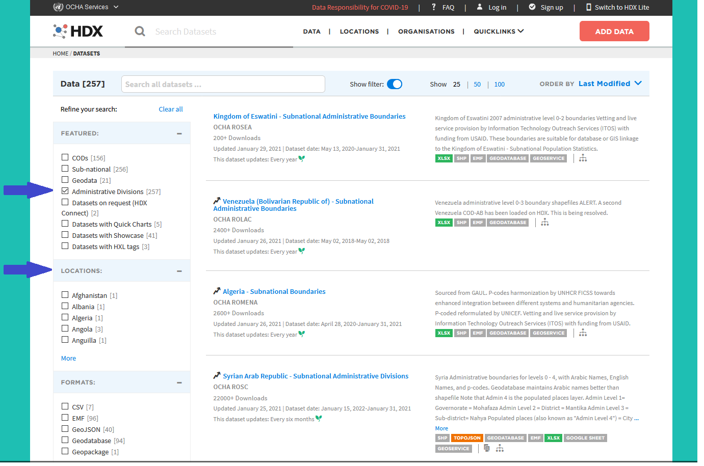
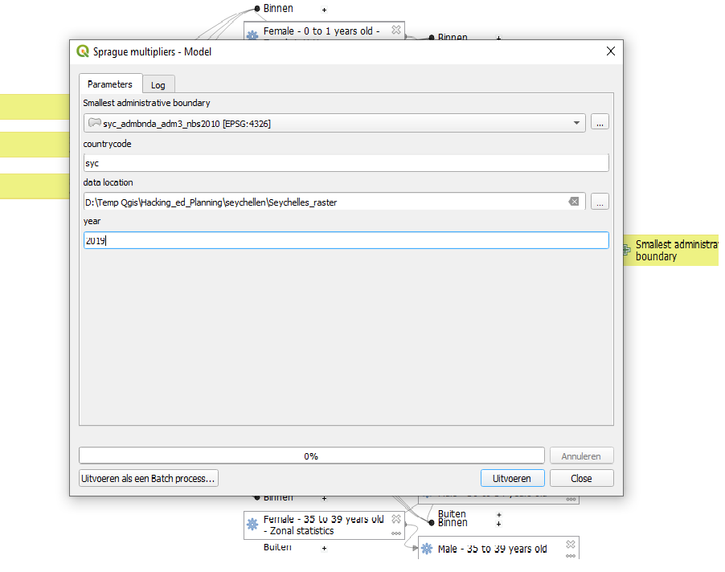
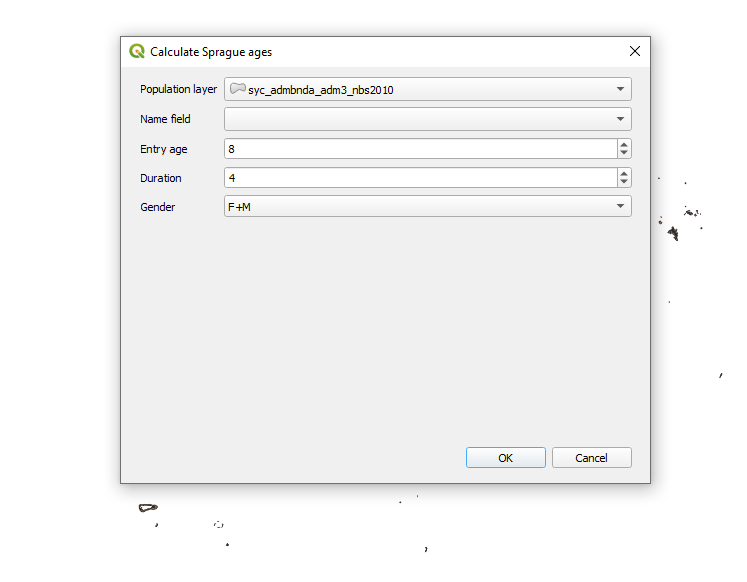

IIEP Hacking edPlanning

Challenge 5 -- Estimating school-age population

Team: QGISnl

Date created: 31-01-2021

Date latest revision: 12-02-2021

# Technical guide / walk through

### Use of sprague-multiplier model and plugin in QGIS 3.x

The challenge was to get population data for custom school-age groups and custom geographical area's. Using the population data from WorldPop, the geographical data from HDX, a QGIS model (improvement on the IIEP version) and the Sprague multiplier methodology (through a new plugin for QGIS).

The following steps will get you population data for user selected geographical area's and a user selected school-age group.

leuk

### A) collect data

##### A-1 Worldpop model and Sprague-multiplier plugin

Download both the worldpop model file and the sprague_plugin zip file from this repository.

##### A-2 country polygon data

Download the shapefiles with the Administrative Boundaries for the country of choice from <https://data.humdata.org/dataset>

Select Administrative Divisions

Select Country

Download the desired geo file, such as gpkg or shp.

##### A-3 Population data

Open QGIS 3.x

In QGIS, open the wgpgDatasets plugin (download from plugin repository if needed, it is an experimental plugin).  This plugin connects to a FTP server from WorldPop and lets you download population data.

Select country of choice and download all 'agesex\_\* raster files, one by one. Optionally, you can have these raster layers added to your qgis project, but it is not necessary for this purpose.

> A pull request has been posted in the wpgpDatasets github to add a multi-select feature. This feature is tested and available at <https://github.com/arongergely/wpgpDataQPD/tree/multiselection>

For the worldpop model to function, you need to download at least all agesex raster datafiles up to age 35-39 (e.g. sec_f\_35_2020.tif ) and both \_f\_ and \_m\_ for a year of choice such as 2019 or 2020.

### B Calculate school-age groups

Add the administrative division files to a new project and zoom to layer.

> The worldpop model uses a polygon layer to process the raster agesex data. It will calculate the results for every polygon in the layer. If, for instance you use an admin3 division (typically a low level administrative division) you will get the results for each and every administration area in the country.
>
> If you wish to see result for just one administration area, the quickest way is probably to use the Split Vector layer tool (Vector \> Datamanagement-tools \> Split Vector layer) and add the specific administration area to your project.
>
> You can also create your own area, e.g. by drawing a polygon on the canvas and saving this polygon as a vector layer.

Open the worldpop model (processing toolbox \> models).

Set the model parameters:

-   Smallest administrative boundary: choose your desired administrative division layer, or your own (newly) created vector layer.

-   country code: type the ISO three letter country code for your country

-   data location: select the data location where you stored the raster files agesex\_\*

-   year: type the year that corresponds with the raster files you downloaded.

Click Run

The model will calculate the population for each raster age_sex group per feature in the vector layer. The vector layer will be updated, new fields will be added, 1 for each raster file, up to age-group 35-39

When finished, install the the sprague-plugin via the plugin manager 'install from zip' option, if you haven't done so already.

Start the sprague plugin

Set the plugin parameters:

Population layer: the updated vector layer containing the newly added population data

Name field: choose a field which you need to identify the different features, e.g. the field containing the names for each administrative area.

Entry age: the low side of your school-age group

Duration: the number of years for the school-system of choice, e.g. primary school could be 6 years, so 6

Gender: choose whether female and male is added up or you want single sex age-groups

Click OK

The plugin creates a new temporary vector layer with three fields: id, name, age_cat_1

The age_cat_1 field contains for each feature the total population for the chosen school-age group, calculated using the Sprague-Multiplier methodology.

Now you have for your chosen geographical are the total population for you school-age group of chocie.

### C) Build an Atlas

to be continued...

### Comments

The Worldpop dataset for Age and sex structures has different versions of data available. The main three datasets are 'constrained', 'constrained UN adjusted' and 'unconstrained'. More information can be
found here: <https://www.worldpop.org/methods/top_down_constrained_vs_unconstrained>

The QGIS wpgpDatasets plugin shows and downloads the 'unconstrained' version, with a filename like: syc_f\_0_2020.tif  (This is the file for Seychelles, female, between 0 and 1 years of age, for 2020).

The constrained and constrained UN adjusted files recognizable filenames: syc_f\_0_2020_constrained.tif, syc_f\_0_2020_constrained_UNadj.tif

The latter two do not work yet within the model.
